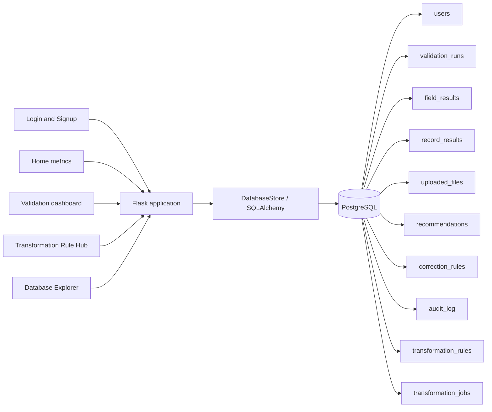

# GenMove V1 PostgreSQL Architecture

All web screens use the same `DatabaseStore` instance created when Flask starts.
The connection is loaded from `.env`, `DATABASE_URL`, or `PG_*` environment
variables. PostgreSQL tables are created automatically through SQLAlchemy and
can also be provisioned explicitly with `database/schema.sql`.

## Screen-to-table mapping

| Screen or feature | PostgreSQL tables |
|---|---|
| Login and Signup | `users`, `audit_log` |
| Home | `validation_runs`, `record_results`, `recommendations` |
| Dashboard and Excel reports | `validation_runs`, `field_results`, `record_results`, `uploaded_files`, `recommendations` |
| PASS/FAIL row drill-down | `validation_runs`, `field_results`, `record_results` |
| Rule Hub | `transformation_rules`, `transformation_jobs`, `audit_log` |
| Correction learning | `correction_rules`, `audit_log` |
| Database Explorer | Approved read-only application tables; the `users` table is intentionally excluded |

## Configuration precedence

1. `DATABASE_URL`
2. `PG_HOST` / `PG_PORT` / `PG_DATABASE` / `PG_USER` / `PG_PASSWORD`
3. Standard libpq names (`PGHOST`, `PGPORT`, `PGDATABASE`, `PGUSER`, `PGPASSWORD`)
4. Legacy MySQL variables, retained only for backward compatibility

Hosted URLs beginning with `postgres://` or `postgresql://` are normalized to
the installed Psycopg 3 driver automatically.
